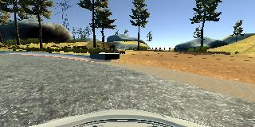
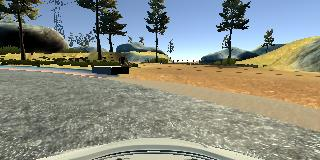
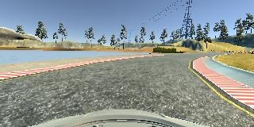
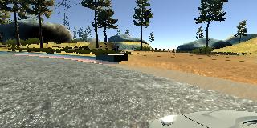
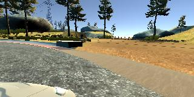

# **Behavioral Cloning** 
---

The goals / steps of this project are the following:
* Use the simulator to collect data of good driving behavior
* Build, a convolution neural network in Keras that predicts steering angles from images
* Train and validate the model with a training and validation set
* Test that the model successfully drives around track one without leaving the road
* Summarize the results with a written report

---
### Reference

Project includes the following files:
* model.py Main project code which is used to create and train the model
* drive.py for driving the car in autonomous mode
* model.h5 containing a trained convolution neural network 
* writeup.md summarizing the results
* output_video.mp4 final output video

#### 2. autonomous driving
Using the Udacity provided simulator and my drive.py file, the car can be driven autonomously around the track by executing 
```sh
python drive.py model.h5
```

#### 3. Model

The **model.py** file contains the code for training and saving the convolution neural network. The file shows the pipeline I used for training and validating the model, and it contains comments to explain how the code works.

The **project.py** file is just a little variation in the model which includes a relu activation instead to relu

### Model Architecture and Training Strategy

#### 1. An appropriate model architecture has been employed

The modified version of the Nvidia CNN Arctitecture is used in the code. The original Architecture is as shown in the image below


The model has BatchNormalizations after each layer and activations are elu. The final layer is connected to a single node as we are just predicting the streering angle. Dropout layer is added to the first Dense layer inorder to avoid overfitting

A detailed explanation is present in [ End-to-End Deep Learning for Self-Driving Cars ](https://devblogs.nvidia.com/deep-learning-self-driving-cars/)

#### 2. Attempts to reduce overfitting in the model

The model contains dropout layer to the first fully connected layer in order to reduce overfitting. 

The model was trained and validated on different data sets to ensure that the model was not overfitting. The model was tested by running it through the simulator and ensuring that the vehicle could stay on the track.

#### 3. Model parameter tuning

The model used an adam optimizer, so the learning rate was not tuned manually.

#### 4. Appropriate training data

Training data was chosen to keep the vehicle driving on the road. I used a combination of center lane driving, recovering from the left and right sides of the road. Further Driving the car multiple laps to take the important data at the sharp curves

##### Sample training data





 
### Model Architecture and Training Strategy

#### 1. Solution Design Approach

One can use a Well tested architecture like the Nvidia CNN in the training process and train it with the enough data to learn how to recover from the corners and to drive through the sharp curves

The Motive is to make a car drive in the center of the road. If we just feed the data while driving in the center of the road the neural network will not be able to recover from the corners. 

Car is to be driven in the center in one lap and drive it to corners in the other so the car will be able to learn to move towards the center. Driving the car in the reverse direction helps the neural network to generalize the data


#### 2. Training the Model

Model did not perform good when it is just trained with one lap training data it drove off the track. so added the data from the multiple laps and from data augmentation

The training loss is about 0.0566

Data augmentation is done to produce more data for the neural network to learn. The images are flipped and the steering angles are multiplied with -1 so the data set size is doubled.

The training and test data is split as 70% and 30%. The model is trained over 5 epochs and then the model is saved to a file named model.h5

The training with this data produced a validation loss as low as 0.0173

The car drove pretty well on the normal track but went over the lane line in the corner and recovered fast. To further avoid this reduced the speed parameter to 6 which worked well in the sharp corners

####  3. Final Model Architecture

The Model summary is as follows
```
_________________________________________________________________
Layer (type)                 Output Shape              Param #   
=================================================================
lambda_1 (Lambda)            (None, 160, 320, 3)       0         
_________________________________________________________________
cropping2d_1 (Cropping2D)    (None, 65, 320, 3)        0         
_________________________________________________________________
conv2d_1 (Conv2D)            (None, 31, 158, 24)       1824      
_________________________________________________________________
activation_1 (Activation)    (None, 31, 158, 24)       0         
_________________________________________________________________
conv2d_2 (Conv2D)            (None, 14, 77, 36)        21636     
_________________________________________________________________
activation_2 (Activation)    (None, 14, 77, 36)        0         
_________________________________________________________________
conv2d_3 (Conv2D)            (None, 5, 37, 48)         43248     
_________________________________________________________________
activation_3 (Activation)    (None, 5, 37, 48)         0         
_________________________________________________________________
conv2d_4 (Conv2D)            (None, 3, 35, 64)         27712     
_________________________________________________________________
activation_4 (Activation)    (None, 3, 35, 64)         0         
_________________________________________________________________
conv2d_5 (Conv2D)            (None, 1, 33, 64)         36928     
_________________________________________________________________
activation_5 (Activation)    (None, 1, 33, 64)         0         
_________________________________________________________________
flatten_1 (Flatten)          (None, 2112)              0         
_________________________________________________________________
dense_1 (Dense)              (None, 100)               211300    
_________________________________________________________________
activation_6 (Activation)    (None, 100)               0         
_________________________________________________________________
dropout_1 (Dropout)          (None, 100)               0         
_________________________________________________________________
dense_2 (Dense)              (None, 50)                5050      
_________________________________________________________________
activation_7 (Activation)    (None, 50)                0         
_________________________________________________________________
dense_3 (Dense)              (None, 10)                510       
_________________________________________________________________
activation_8 (Activation)    (None, 10)                0         
_________________________________________________________________
dense_4 (Dense)              (None, 1)                 11        
=================================================================
Total params: 348,219
Trainable params: 348,219
Non-trainable params: 0
_________________________________________________________________
```
